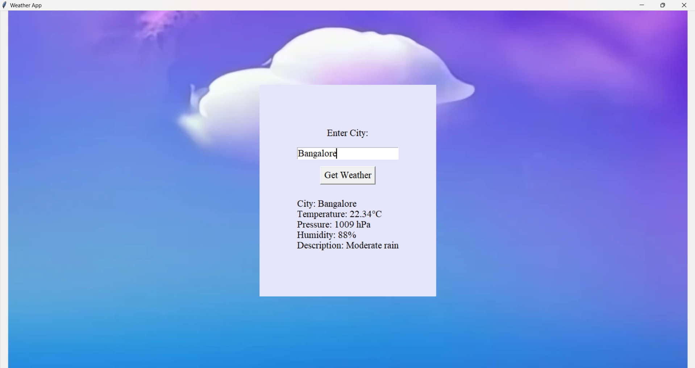

# About this Weather Application

This is a simple weather application built with Python using the `tkinter` library for the graphical user interface and the `requests` library to fetch weather data from the OpenWeatherMap API. The application also uses the `Pillow` library for handling background images.

## Features

- Enter a city name to get the current weather.
- Displays temperature, pressure, humidity, and weather description.
- Customizable user interface with background image and font settings.

## Requirements

- Python 3.6+
- `requests` library
- `Pillow` library
- `tkinter` library (comes pre-installed with Python)

# Screenshot of this web application:

# Customization of user interface

-- The use of background images, frames, background colors, and fonts enhances the user interface, providing a polished and visually appealing look.

# Run the application
python weatherapp.py
